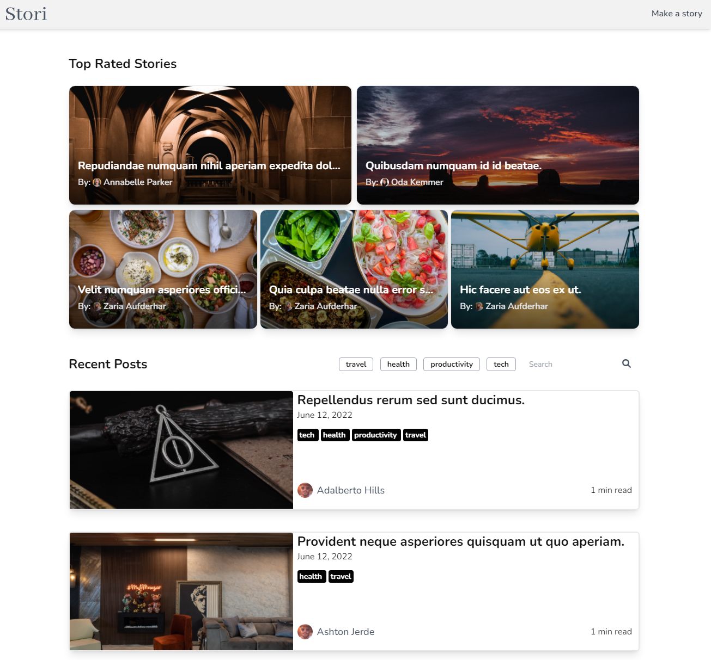

<h1 style="text-align: center;">Stori</h1>

Share and connect your story with other 8 billion people

Stori is a blogging platform built with Laravel with a full CRUD functionality and a wide rich of features

## Table of Contents

- [Live Demo](#live-demo)
- [Features](#features)
- [Tech](#tech)
- [Running locally](#running-locally)
- [Screenshots](#screenshots)

## Live Demo

[Click Here](https://stori-laravel.herokuapp.com)

## Features

- responsive design
- new account registration functionality.
- login with username or email and password.
- Oauth2 (Google and Github) authentication.
- password reset functionality.
- edit or delete user account.
- profile customization.
- dashboard to manage user's posts.
- add, edit and delete posts.
- react to a post.
- add comment to a post.
- react to a comment.
- post filter by tag and search by keyword
- ...

## Tech

This project is built with:

- Laravel 9
- Tailwindcss
- Alpinejs
- Laravel Socialite package
- Laravel Like package

## Running locally

- Clone this repo
- rename '.env.example' to '.env'
- run 'php artisan key:generate'
- configure your database connection:

'''
DB_CONNECTION=mysql
DB_HOST=127.0.0.1
DB_PORT=3306
DB_DATABASE=name
DB_USERNAME=root
DB_PASSWORD=
'''

- configure your smtp mail service connection:

'''
MAIL_MAILER=smtp
MAIL_HOST=
MAIL_PORT=587
MAIL_USERNAME=
MAIL_PASSWORD=
MAIL_ENCRYPTION=ssl
MAIL_FROM_ADDRESS=
MAIL_FROM_NAME=
'''

- configure your Oauth2 client id and secret
  '''
  GITHUB_CLIENT_ID=
  GITHUB_CLIENT_SECRET=

GOOGLE_CLIENT_ID=
GOOGLE_CLIENT_SECRET=
'''

- run 'composer install'
- run 'npm install'
- run 'npm run watch'
- run 'php artisan serve'

## Screenshots

Home page

Register page

Post page

Create post page

Dashboard page

Profile page

Profile settings page

Account Settings page

